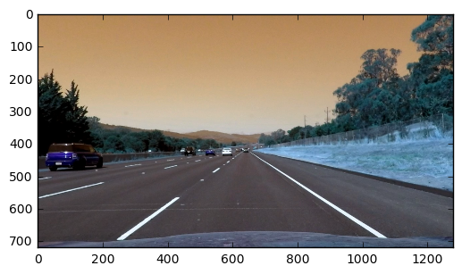
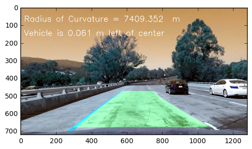

# CarND Andvanced Lane Lines
this project goal is 
> 
 1. Compute the camera calibration matrix and distortion coefficients given a set of chessboard images.
 2. Apply a distortion correction to raw images.
 3. Use color transforms, gradients, etc., to create a thresholded binary image.
 4. Apply a perspective transform to rectify binary image ("birds-eye view").
 5. Detect lane pixels and fit to find the lane boundary.
 6. Determine the curvature of the lane and vehicle position with respect to center.
 7. Warp the detected lane boundaries back onto the original image.
 8. Output visual display of the lane boundaries and numerical

[//]: # (Image References)

[image1]: ./examples/undistort_output.png "Undistorted"
[image2]: ./test_images/test1.jpg "Road Transformed"
[image3]: ./examples/binary_combo_example.jpg "Binary Example"
[image4]: ./examples/warped_straight_lines.jpg "Warp Example"
[image5]: ./examples/color_fit_lines.jpg "Fit Visual"
[image6]: ./examples/example_output.jpg "Output"
[video1]: ./project_video.mp4 "Video"
## [Rubric](https://review.udacity.com/#!/rubrics/571/view) Points

###Camera Calibration

####1. Briefly state how you computed the camera matrix and distortion coefficients. Provide an example of a distortion corrected calibration image.
The code for this is showed blow.
first I used image_list to stored the loaded images which path is  "./camera_cal/".And I also create a image_gray_list to store the gray image.
I created the 'obj_points' which will be the (x, y, z) coordinates of the chessboard corners in the world. and it will be appended with a copy of it every time I successfully detect all chessboard corners in a test image.
I created the 'img_points' which will be appended with the (x, y) pixel position of each of the corners in the image plane with each successful chessboard detection.

I get 'obj_points and img_points'  to compute the camera calibration and distortion coefficients using the `cv2.calibrateCamera()` function.  I applied this distortion correction to the test image using the `cv2.undistort()` function and obtained this result.
the result is blow the code ,in the code output


```python
import numpy as np
import cv2
import matplotlib.pyplot as plt
import matplotlib.image as mpimg
import glob
%matplotlib inline
#%matplotlib qt
import os
#defint value
nx = 9 # number of inside cornets in x
ny = 6  # number of inside corners in y
camera_cal_path = "./camera_cal/"
#load data
image_list = []
file_list = os.listdir(camera_cal_path)
image = cv2.imread(file_list[0])
for file in file_list:
    image_list.append(cv2.imread(camera_cal_path+file))
# gray the image 
image_gray_list = []
for image in image_list:
    image_gray_list.append(cv2.cvtColor(image,cv2.COLOR_BGR2GRAY))
 # calibrate Camera effiecients
objp = np.zeros((nx*ny,3),np.float32)
objp[:,:2]= np.mgrid[0:nx,0:ny].T.reshape(-1,2)
img_points = []
obj_points = []
for gray in image_gray_list:
    ret,corners = cv2.findChessboardCorners(gray,(nx,ny),None)
    if ret:
            img_points.append(corners)
            obj_points.append(objp)
ret,mtx,dist,revcs,tvecs = cv2.calibrateCamera(obj_points,img_points,image_gray_list[0].shape[::-1],None,None)

```

## ###Pipeline (single images)

####1. Provide an example of a distortion-corrected image.
the undistored image is showed in code output.one is calibarate image which is chessboard,other is test image.


```python
%matplotlib inline

# undistort the image
def getUndistortImage(img):
    undistort = cv2.undistort(img,mtx,dist,None,mtx)
    return undistort
img = image_list[0]
print("ORIGIN IMAGE")
plt.imshow(img)
plt.show()
print("UNDISTORTED IMAGE")
img = getUndistortImage(img)
plt.imshow(img)
plt.show()


```


    UNDISTORTED IMAGE


    ORIGIN IMAGE


```python
#%matplotlib qt
# read image
#img = cv2.imread("./test_images/test4.jpg")
img = cv2.imread("./test_images/straight_lines2.jpg")
img_size = img.shape[::-1]
print("origin image")
plt.imshow(img)
plt.show()
undistorted_img = getUndistortImage(img)
print("UNDISTORTED IMAGE")
plt.imshow(undistorted_img)
plt.show()
```





    UNDISTORTED IMAGE


    origin image


####2. Describe how (and identify where in your code) you used color transforms, gradients or other methods to create a thresholded binary image.  Provide an example of a binary image result.
I used a combination of color and gradient thresholds to generate a binary image (thresholding steps at lines # through # in `another_file.py`).  Here's an example of my output for this step.  (note: this is not actually from one of the test images)
before gradient the image ,I convert the image to gray.
and I write a mag_thresh function to gradient the image,the sobel_kernel =15, mag_thresh=(60, 255),tan_thresh = (0.7, 1.3))
I used tan_thresh to select the tan_Sobel = np.arctan2(np.absolute(sobelY),np.absolute( sobelX)) value.In this function ,Ireturned the binary which mag_binary==1 & arctan_binary == 1.
The code is blow in line 135 -191 in function mag_thresh
for the color selection,I converted the image to hls image ,and I used the s channel to selected the binary result.
The code is blow in line 192-206 in function hls_thresh
Last I combination of color and gradient thresholds to generate a binary.
The code is blow in line 210-234 the combination is in imgMagAndhlsFilter(image) function.
and the result is in the code output,title is Mag And HLS Filtered Image


```python
def mag_thresh(image,sobel_kernel =3,mag_thresh =(0,255),tan_thresh = (0, np.pi/2),
x_thresh= (0,255),y_thresh = (0,255),is_color_image = False):
    # Apply the following steps to img
    # 1) Convert to grayscale
        
    #print("SHOW GRAY IMAGE")
    #plt.imshow(gray,'gray')
    #plt.show()
    # 2) Take the gradient in x and y separately
    sobelX = cv2.Sobel(image,cv2.CV_64F,1,0,ksize = sobel_kernel)
    sobelY = cv2.Sobel(image,cv2.CV_64F,0,1,ksize = sobel_kernel)
    abs_SobelX = np.absolute(sobelX)
    abs_SobelY = np.absolute(sobelY)
    # 3) Calculate the magnitude 
    gradmag = np.sqrt(sobelX**2 + sobelY**2)
    tan_Sobel = np.arctan2(np.absolute(sobelY),np.absolute( sobelX))
    # 4) Scale to 8-bit (0 - 255) and convert to type = np.uint8
    scale_factor = np.max(gradmag)/255 
    #scaled_sobel = np.uint8(gradmag/scale_factor)
    scaled_sobel = (gradmag/scale_factor).astype(np.uint8)

    # 3) Take the absolute value of the derivative or gradient
    abs_sobelx = np.absolute(sobelX)
    abs_sobely = np.absolute(sobelY)
    # 4) Scale to 8-bit (0 - 255) then convert to type = np.uint8
    scaled_sobely = np.uint8(255*abs_sobely/np.max(abs_sobely))
    scaled_sobelx = np.uint8(255 * abs_sobelx / np.max(abs_sobelx))
                             
    # 5) Create a binary mask where mag thresholds are met
    binary_output = np.zeros_like(scaled_sobel)
    mag_binary = np.zeros_like(scaled_sobel)
    sobelx_binary = np.zeros_like(scaled_sobelx)
    sobely_binary = np.zeros_like(scaled_sobely)
    arctan_binary = np.zeros_like(tan_Sobel)

    mag_binary[(scaled_sobel>= mag_thresh[0]) & (scaled_sobel <= mag_thresh[1])] = 1
    #plt.imshow(mag_binary,'gray')
    #plt.show()
    
    #sobelx_binary[(scaled_sobelx >=200) & (scaled_sobelx <= 255)] = 1
    #plt.imshow(sobelx_binary,'gray')
    #plt.show()
    # didnot use
    #sobely_binary[(scaled_sobely >= 20) & (scaled_sobely <= 40)] = 1
    #plt.imshow(sobely_binary,'gray')
    #plt.show()
    arctan_binary[(tan_Sobel>= tan_thresh[0]) & (tan_Sobel <= tan_thresh[1])] = 1
    # plt.imshow(arctan_binary,'gray')
    # plt.show()
    binary_output[(mag_binary==1) & (arctan_binary == 1) ] = 1
    # plt.imshow(binary_output,'gray')
    # plt.show()
    #binary_output[(scaled_sobel >= mag_thresh[0]) & (scaled_sobel <= mag_thresh[1])
    #& (scaled_sobely >20) & (scaled_sobely <=100)]= 1
    # 
    return binary_output
#& (tan_Sobel >= tan_thresh[0]) & (tan_Sobel <= tan_thresh[1])] = 1
    # 6) Return this mask as your binary_output image
    #@return binary_output
def hls_thresh(image,color_thresh = (0,255)):
    # Convert the Image 2 HLS
    hlsimage = cv2.cvtColor(image,cv2.COLOR_RGB2HLS)
    # Get the sChannel
    s_channel = hlsimage[:,:,2]
    s_binary = np.zeros_like(s_channel)
    # Flitter the Image with color Schannel
    s_binary[(s_channel > color_thresh[0]) &(s_channel <= color_thresh[1] ) ] = 1
    return s_binary
# mag_binary = mag_thresh(undistorted_image, sobel_kernel=5, mag_thresh=(120, 200),tan_thresh = (0.7, 1.3),x_thresh=(100,101),y_thresh=(200,255))
```


```python
def imgMagAndhlsFilter(image):
    #print("UNDISTORTED IMAGE")
    #plt.imshow(image)
    #plt.show()
    #mag_binary = mag_thresh(undistorted_image, sobel_kernel=19, mag_thresh=(60, 255),tan_thresh = (-np.pi/2, np.pi/2))
    gray = cv2.cvtColor(image,cv2.COLOR_RGB2GRAY)
    mag_binary = mag_thresh(gray, sobel_kernel=15, mag_thresh=(60, 255),tan_thresh = (0.7, 1.3))
    #print('Thresholded Magnitude')
    #plt.imshow(mag_binary,'gray')
    #plt.show()
    s_binary = hls_thresh(image,color_thresh = (180,220))
    #print("S CHANNEL IMAGE")
    #plt.imshow(s_binary,'gray')
    #plt.show()
    combined_binary  =np.zeros_like(mag_binary)
    combined_binary[(mag_binary == 1) | (s_binary == 1)] = 1
    #print("COMBINED IMAGE")
    #plt.imshow(combined_binary,'gray')
    #plt.show()
    return combined_binary

mag_hls_image = imgMagAndhlsFilter(undistorted_img)
print("Mag And HLS Filtered Image")
plt.imshow(mag_hls_image,"gray")
plt.show()


```


    Mag And HLS Filtered Image


####3. Describe how (and identify where in your code) you performed a perspective transform and provide an example of a transformed image.

The code for my perspective transform includes a function called `getPerspectiveImage`, which appears in blowed code cell   The `getPerspectiveImage` function takes as inputs an image (`image`), as well as source (`src`) and destination (`dst`) points.  I chose the hardcode the source and destination points in the following manner:

```
src = np.float32([ [440,500],[870,500],[1380,680],[0,680]])
dst= np.float32([[0,300],[1280,300],[1280,720],[0,720]])
```
This resulted in the following source and destination points:

| Source        | Destination   | 
|:-------------:|:-------------:| 
| 440, 500      | 0 300       | 
| 870, 500      | 1280, 300      |
| 1380, 680     | 1280, 720      |
| 0, 680      | 0, 720        |

I verified that my perspective transform was working as expected by drawing the `src` and `dst` points onto a test image and its warped counterpart to verify that the lines appear parallel in the warped image.
I draw the src points in the code cell output.
And I create a new function to cap the function for after using.
The bird view image is also in the code cell output.which looks parallel


```python
def getPerspectiveImage(image,src,dst):
 #   offset = 0#100
    img_size = (image.shape[1],img.shape[0])
    M = cv2.getPerspectiveTransform(src,dst)
    Minv = cv2.getPerspectiveTransform(dst,src)
    warped = cv2.warpPerspective(image, M,img_size)
    return warped,M,Minv
src = np.float32([ [460,500],[865,500],[1450,700],[0,700]])
def image2PerspectiveImage(image):
    #print('Thresholded Magnitude')
    #get birds view    
    #src = np.float32([ [430,510],[855,510],[1320,700],[0,700]])
    #src = np.float32([ [430,500],[855,500],[1320,700],[0,700]])
    src = np.float32([ [440,500],[870,500],[1380,680],[0,680]])
    dst= np.float32([[0,300],[1280,300],[1280,720],[0,720]])
    img_size = (image.shape[1],image.shape[0])
    # src = np.float32(
    # [[(img_size[0] / 2) - 55, img_size[1] / 2 + 100],
    # [((img_size[0] / 6) - 10), img_size[1]],
    # [(img_size[0] * 5 / 6) + 60, img_size[1]],
    # [(img_size[0] / 2 + 55), img_size[1] / 2 + 100]])
    # dst = np.float32(
    # [[(img_size[0] / 4), 0],
    # [(img_size[0] / 4), img_size[1]],
    # [(img_size[0] * 3 / 4), img_size[1]],
    # [(img_size[0] * 3 / 4), 0]])
    #print("darw  the selected point in image")
    #plt.imshow(image,'gray')
    # for i in range(4):
    #     plt.plot(src[i][0],src[i][1],'.')
    #     plt.show()
    warped_image,M,Minv = getPerspectiveImage(image,src,dst)
    #print("perspecitve image:")
    #plt.imshow(warped_image,'gray')
    #plt.show()
    return warped_image,M,Minv
#warped_image,M,Minv = image2PerspectiveImage(img)
#src = np.float32([ [430,510],[855,510],[1320,700],[0,700]])
plt.imshow(mag_hls_image,'gray')
for i in range(4):
    plt.plot(src[i][0],src[i][1],'.')
plt.show()
perspective_img,M,Minv = image2PerspectiveImage(mag_hls_image)
plt.imshow(perspective_img,"gray")
plt.show()
    
```


####4. Describe how (and identify where in your code) you identified lane-line pixels and fit their positions with a polynomial?
I used the function findRoadFit(image) which is in belowed code cell to get the lane fits.
首先，我在图片的高度的中间，找到了两侧最大的值，作为 leftx_base and rightx_base.
通过里line_width =  rightx_base - leftx_base 我获得了这两条平行线间的宽度。
我使用了左右两侧各6个窗口，窗口宽度为margin ×2 = 240 高度为图片高度/6.
在每个窗口中，找到非零点，若窗口的非零点个数大于minpix= 100 ，则认为该区域有效。并将该区域点密集区域的平均值作为有效点。并且作为下一次窗口起始点。为了防止某些情况下单侧没有点存在，使用左侧，或右侧的有效点，作为不存在有效点的一侧的参考位置，该位置获得方法为 当左侧无有效点存在时：右侧 - 平行线宽度。 当右侧无有效点存在时: 左侧 + 平行线宽度
获得了图片中的左右点位置后，使用 np.polyfit(left_current_y_array,left_current_x_array,2)，进行拟合，得到左右的拟合曲线。
代码在如下code cell中，结果绘制在code cell 的output中


```python
import numpy as np
import cv2
import matplotlib.pyplot as plt
#histogram = np.sum(warped_image[int(warped_image.shape[0]/2):,:], axis=0)
#plt.plot(histogram)
ploty = np.linspace(0, image.shape[0]-1, image.shape[0] )
def findRoadFit(image):
    # Take a histogram of the bottom half of the image
    histogram = np.sum(image[int(image.shape[0]/2):,:], axis=0)
    # Create an output image to draw on and  visualize the result
    out_img = np.dstack((image, image, image))*255
    # Find the peak of the left and right halves of the histogram
    # These will be the starting point for the left and right lines
    midpoint = np.int(histogram.shape[0]/2)
    leftx_base = np.argmax(histogram[:midpoint])
    rightx_base = np.argmax(histogram[midpoint:]) + midpoint
    #the two parallel lines width
    line_width = rightx_base - leftx_base       
    # for the lane and the position of the vehicle with respect to center:
    line_bias_pixel = (rightx_base + leftx_base)/2 - midpoint    
    #print(line_bias_pixel)
    #print("leftx_base = ",leftx_base)
    #print("rightx_base = ",rightx_base)
    # Choose the number of sliding windows
    nwindows = 6
    # Set height of windows
    window_height = np.int(image.shape[0]/nwindows)
    # Identify the x and y positions of all nonzero pixels in the image
    nonzero = image.nonzero()
    nonzeroy = np.array(nonzero[0])
    nonzerox = np.array(nonzero[1])    
    # Current positions to be updated for each window
    leftx_current = leftx_base
    rightx_current = rightx_base
    # Set the width of the windows +/- marpgin
    margin = 120
    # Set minimum number of pixels found to recenter window
    minpix = 80
    # Create empty lists to receive left and right lane pixel indices
    left_lane_inds = []
    right_lane_inds = []
    # Step through the windows one by one
    left_current_x_array,left_current_y_array,right_current_x_array,right_current_y_array = [],[],[],[]    
    for window in range(nwindows):
        # Identify window boundaries in x and y (and right and left)
        win_y_low = image.shape[0] - (window+1)*window_height
        win_y_high = image.shape[0] - window*window_height
        win_xleft_low = leftx_current - margin
        win_xleft_high = leftx_current + margin
        win_xright_low = rightx_current - margin
        win_xright_high = rightx_current + margin
        # Draw the windows on the visualization image
        cv2.rectangle(out_img,(win_xleft_low,win_y_low),(win_xleft_high,win_y_high),(0,255,0), 2) 
        cv2.rectangle(out_img,(win_xright_low,win_y_low),(win_xright_high,win_y_high),(0,255,0), 2) 
        # Identify the nonzero pixels in x and y within the window
        good_left_inds = ((nonzeroy >= win_y_low) & (nonzeroy < win_y_high) & (nonzerox >= win_xleft_low) & (nonzerox < win_xleft_high)).nonzero()[0]
        good_right_inds = ((nonzeroy >= win_y_low) & (nonzeroy < win_y_high) & (nonzerox >= win_xright_low) & (nonzerox < win_xright_high)).nonzero()[0]
        # Append these indices to the lists
        left_lane_inds.append(good_left_inds) 
        right_lane_inds.append(good_right_inds)
        
        # If you found > minpix pixels, recenter next window on their mean position
        left_good = (len(good_left_inds) > minpix)
        right_good = (len(good_right_inds) > minpix)
        
        if left_good:
            leftx_current = np.int(np.mean(nonzerox[good_left_inds]))            
        if right_good:
            rightx_current = np.int(np.mean(nonzerox[good_right_inds]))
        else:
            continue
        if left_good :            
            lefty_current = np.int(np.mean(nonzeroy[good_left_inds]))
        elif right_good :
            leftx_current =  rightx_current - line_width
            lefty_current = np.int((win_y_low+win_y_high)/2)       
            
        if right_good :            
            righty_current = np.int(np.mean(nonzeroy[good_right_inds]))
        elif left_good:
            rightx_current =  leftx_current+ line_width
            righty_current = np.int((win_y_low+win_y_high)/2)

        if lefty_current is None:
            lefty_current = np.int((win_y_low+win_y_high)/2)
        if righty_current is None:
            righty_current = np.int((win_y_low+win_y_high)/2)

        if len(good_left_inds) > minpix:
        #     leftx_current = np.int(np.mean(nonzerox[good_left_inds]))
        #     lefty_current = np.int(np.mean(nonzeroy[good_left_inds]))
        # else :
        #     leftx_current =  leftx_base
        #     lefty_current = np.int((win_y_low+win_y_high)/2)
        # if len(good_right_inds) > minpix:                    
        #     rightx_current = np.int(np.mean(nonzerox[good_right_inds]))            
        #     righty_current = np.int(np.mean(nonzeroy[good_right_inds]))
        # else:
        #     rightx_current =  rightx_base
        #     righty_current = np.int((win_y_low+win_y_high)/2)
        
        left_current_y_array.append(lefty_current)
        right_current_x_array.append(rightx_current)
        right_current_y_array.append(righty_current)       
    
    # Concatenate the arrays of indices
    left_lane_inds = np.concatenate(left_lane_inds)
    right_lane_inds = np.concatenate(right_lane_inds)    
    # Extract left and right line pixel positions
    leftx = nonzerox[left_lane_inds]
    lefty = nonzeroy[left_lane_inds] 
    rightx = nonzerox[right_lane_inds]
    righty = nonzeroy[right_lane_inds]
    
    # Fit a second order polynomial to each
    #left_fit = np.polyfit(lefty, leftx, 2)
    #right_fit = np.polyfit(righty, rightx, 2)
    left_fit= np.polyfit(left_current_y_array,left_current_x_array,2)
    right_fit = np.polyfit(right_current_y_array,right_current_x_array,2)
    #Visualization    
    #Visualization The Reuslt
    # Generate x and y values for plotting   
    out_img[nonzeroy[left_lane_inds], nonzerox[left_lane_inds]] = [255, 0, 0]
    out_img[nonzeroy[right_lane_inds], nonzerox[right_lane_inds]] = [0, 0, 255]    
    #return left_fit,right_fit,ploty,leftx,lefty,rightx,righty
    return left_fit,right_fit,left_current_x_array,left_current_y_array,right_current_x_array,right_current_y_array,line_bias_pixel,out_img
```


```python
left_fit,right_fit,leftx,lefty,rightx,righty,line_bias_pixel,out_img = findRoadFit(perspective_img)
def getOutImage(image,left_fit,right_fit):
    ploty = np.linspace(0, image.shape[0]-1, image.shape[0] )
    left_fitx = left_fit[0]*ploty**2 + left_fit[1]*ploty + left_fit[2]
    right_fitx = right_fit[0]*ploty**2 + right_fit[1]*ploty + right_fit[2]
    return left_fitx,right_fitx
left_fitx,right_fitx = getOutImage(out_img,left_fit,right_fit)
plt.imshow(out_img)
plt.plot(left_fitx, ploty, color='yellow')
plt.plot(right_fitx, ploty, color='yellow')
plt.xlim(0, 1280)
plt.ylim(720, 0)

```


    (720, 0)


```python
def findNextRoadFit(image,left_fit,right_fit):
        # Assume you now have a new warped binary image 
    # from the next frame of video (also called "binary_warped")
    # It's now much easier to find line pixels!
    nonzero = image.nonzero()
    nonzeroy = np.array(nonzero[0])
    nonzerox = np.array(nonzero[1])
    margin = 120
    left_lane_inds = ((nonzerox > (left_fit[0]*(nonzeroy**2) + left_fit[1]*nonzeroy + left_fit[2] - margin)) & (nonzerox < (left_fit[0]*(nonzeroy**2) + left_fit[1]*nonzeroy + left_fit[2] + margin))) 
    right_lane_inds = ((nonzerox > (right_fit[0]*(nonzeroy**2) + right_fit[1]*nonzeroy + right_fit[2] - margin)) & (nonzerox < (right_fit[0]*(nonzeroy**2) + right_fit[1]*nonzeroy + right_fit[2] + margin)))
    # Assume you now have a new warped binary image 
    # from the next frame of video (also called "binary_warped")
    # It's now much easier to find line pixels!
    nonzero = image.nonzero()
    nonzeroy = np.array(nonzero[0])
    nonzerox = np.array(nonzero[1])

    left_lane_inds = ((nonzerox > (left_fit[0]*(nonzeroy**2) + left_fit[1]*nonzeroy + left_fit[2] - margin)) & (nonzerox < (left_fit[0]*(nonzeroy**2) + left_fit[1]*nonzeroy + left_fit[2] + margin))) 
    right_lane_inds = ((nonzerox > (right_fit[0]*(nonzeroy**2) + right_fit[1]*nonzeroy + right_fit[2] - margin)) & (nonzerox < (right_fit[0]*(nonzeroy**2) + right_fit[1]*nonzeroy + right_fit[2] + margin)))  
    # Again, extract left and right line pixel positions
    leftx = nonzerox[left_lane_inds]
    lefty = nonzeroy[left_lane_inds] 
    rightx = nonzerox[right_lane_inds]
    righty = nonzeroy[right_lane_inds]
    
    # Fit a second order polynomial to each
    left_fit = np.polyfit(lefty, leftx, 2)
    right_fit = np.polyfit(righty, rightx, 2)
    # Generate x and y values for plotting
    ploty = np.linspace(0, image.shape[0]-1,image.shape[0] )    
    left_fitx = left_fit[0]*ploty**2 + left_fit[1]*ploty + left_fit[2]
    right_fitx = right_fit[0]*ploty**2 + right_fit[1]*ploty + right_fit[2]

    # Create an image to draw on and an image to show the selection window
    out_img = np.dstack((image,image,image))*255
    window_img = np.zeros_like(out_img)
    # Color in left and right line pixels
    out_img[nonzeroy[left_lane_inds], nonzerox[left_lane_inds]] = [255, 0, 0]
    out_img[nonzeroy[right_lane_inds], nonzerox[right_lane_inds]] = [0, 0, 255]

    # Generate a polygon to illustrate the search window area
    # And recast the x and y points into usable format for cv2.fillPoly()
    left_line_window1 = np.array([np.transpose(np.vstack([left_fitx-margin, ploty]))])
    left_line_window2 = np.array([np.flipud(np.transpose(np.vstack([left_fitx+margin, ploty])))])
    left_line_pts = np.hstack((left_line_window1, left_line_window2))
    right_line_window1 = np.array([np.transpose(np.vstack([right_fitx-margin, ploty]))])
    right_line_window2 = np.array([np.flipud(np.transpose(np.vstack([right_fitx+margin, ploty])))])
    right_line_pts = np.hstack((right_line_window1, right_line_window2))

    # Draw the lane onto the warped blank image
    cv2.fillPoly(window_img, np.int_([left_line_pts]), (0,255, 0))
    cv2.fillPoly(window_img, np.int_([right_line_pts]), (0,255, 0))
    result = cv2.addWeighted(out_img, 1, window_img, 0.3, 0)
    plt.imshow(result)
    plt.plot(left_fitx, ploty, color='yellow')
    plt.plot(right_fitx, ploty, color='yellow')
    plt.xlim(0, 1280)
    plt.ylim(720, 0)
    return left_fit,right_fit,ploty,leftx,lefty,rightx,righty
    #return left_fit,right_fit,ploty,leftx
   
```


```python
#GET PLOYFIT
#left_fit,right_fit,leftx,lefty,rightx,righty = findRoadFit(warped_image)
#left_fit,right_fit,leftx,lefty,rightx,righty,line_bias_pixel = findRoadFit(warped_image)
#print(left_fit)
#print(right_fit)
#findNextRoadFit(warped_image,left_fit,right_fit)

```

####5. Describe how (and identify where in your code) you calculated the radius of curvature of the lane and the position of the vehicle with respect to center.

I did this in below code cell:
the fit is : f(y)=Ay​**2​​ +By+C
so the curverad is:
curverad= ((1 + (2*left_fit[0]*y_eval + left_fit[1])**2)**1.5) / np.absolute(2*left_fit[0])
for the lane and the position of the vehicle with respect to center:
the line_bias_pixel is return in the findroadFit().It calculate by:
line_bias_pixel = (rightx_base + leftx_base)/2 - midpoint
the rightx_base the leftx_base is when y is center of the image height,and the x position which is none zero value mean
value. the (rightx_base + leftx_base)/2 is current parallel center position and use it to sub the center of the image width ,then plus the 3.7/700(per pixel to metter) is the position of the vehicle.
#I used  3.7/700 * line_bias_pixel


```python

def calculateCurverad(left_fit,right_fit):
    y_eval = np.max(ploty)
    left_curverad = ((1 + (2*left_fit[0]*y_eval + left_fit[1])**2)**1.5) / np.absolute(2*left_fit[0])
    right_curverad = ((1 + (2*right_fit[0]*y_eval + right_fit[1])**2)**1.5) / np.absolute(2*right_fit[0])    
    return left_curverad,right_curverad
def calculateCurveradMeters(leftx,rightx,lefty,righty):
    #Define conversions in x and y from pixels space to meters
    y_eval = np.max(leftx)
    ym_per_pix = 30/720 # meters per pixel in y dimension
    xm_per_pix = 3.7/700 # meters per pixel in x dimension
    # Fit new polynomials to x,y in world space
    #print(ploty)
    #print(leftx)
    #print(rightx)
    #leftx = leftx[::-1]  # Reverse to match top-to-bottom in y
    #rightx = rightx[::-1]  # Reverse to match top-to-bottom in y
    #print(len(ploty*ym_per_pix))
    #print(len(leftx*xm_per_pix))
    left_fit_cr = np.polyfit(lefty*ym_per_pix, leftx*xm_per_pix, 2)
    right_fit_cr = np.polyfit(righty*ym_per_pix, rightx*xm_per_pix, 2)
    # Calculate the new radii of curvature
    
    left_curverad_meters = ((1 + (2*left_fit_cr[0]*y_eval*ym_per_pix + left_fit_cr[1])**2)**1.5) / np.absolute(2*left_fit_cr[0])
    right_curverad_meters = ((1 + (2*right_fit_cr[0]*y_eval*ym_per_pix + right_fit_cr[1])**2)**1.5) / np.absolute(2*right_fit_cr[0])
    # Now our radius of curvature is in meters
    # if left_curverad_meters >1000:
    #     left_curverad_meters = 0
    # if right_curverad_meters >1000:
    #     right_curverad_meters = 0
        
    return left_curverad_meters,right_curverad_meters
```


```python
left_curverad, right_curverad = calculateCurverad(left_fit,right_fit)
left_curverad_meters , right_curverad_meters = calculateCurveradMeters(np.array(leftx),
                         np.array(rightx),
                         np.array(lefty),
                         np.array(righty))
print(left_curverad, right_curverad)
print(left_curverad_meters, 'm', right_curverad_meters, 'm')
print(line_bias_pixel)
print("distance={} m ".format(3.7/700 * line_bias_pixel))
```

    4078.54254855 58980.9875731
    1327.0545372 m 19371.9023801 m
    -39.0
    distance=-0.20614285714285716 m 


```python
def getUnPerspectiveImage(warped_img,undistorted_img,left_fit,right_fit,Minv):
    # Create an image to draw the lines on
    warp_zero = np.zeros_like(warped_img).astype(np.uint8)
    color_warp = np.dstack((warp_zero, warp_zero, warp_zero))
    ploty = np.linspace(0, image.shape[0]-1, image.shape[0] )
    left_fitx = left_fit[0]*ploty**2 + left_fit[1]*ploty + left_fit[2]
    right_fitx = right_fit[0]*ploty**2 + right_fit[1]*ploty + right_fit[2]
    # Recast the x and y points into usable format for cv2.fillPoly()
    pts_left = np.array([np.transpose(np.vstack([left_fitx, ploty]))])
    pts_right = np.array([np.flipud(np.transpose(np.vstack([right_fitx, ploty])))])
    pts = np.hstack((pts_left, pts_right))
    # Draw the lane onto the warped blank image
    cv2.fillPoly(color_warp, np.int_([pts]), (0,255, 0))
    # Warp the blank back to original image space using inverse perspective matrix (Minv)
    newwarp = cv2.warpPerspective(color_warp, Minv,
                              (undistorted_img.shape[1], undistorted_img.shape[0]))
    # Combine the result with the original image
    result = cv2.addWeighted(undistorted_img, 1, newwarp, 0.3, 0)
    return result
# #plt.imshow(perspective_img,'gray')
# plt.show()
# # Create an image to draw the lines on
# warp_zero = np.zeros_like(perspective_img).astype(np.uint8)
# color_warp = np.dstack((warp_zero, warp_zero, warp_zero))
# ploty = np.linspace(0, image.shape[0]-1, image.shape[0] )
# left_fitx = left_fit[0]*ploty**2 + left_fit[1]*ploty + left_fit[2]
# right_fitx = right_fit[0]*ploty**2 + right_fit[1]*ploty + right_fit[2]
# # Recast the x and y points into usable format for cv2.fillPoly()
# pts_left = np.array([np.transpose(np.vstack([left_fitx, ploty]))])
# pts_right = np.array([np.flipud(np.transpose(np.vstack([right_fitx, ploty])))])
# pts = np.hstack((pts_left, pts_right))
# # Draw the lane onto the warped blank image
# cv2.fillPoly(color_warp, np.int_([pts]), (0,255, 0))
# # Warp the blank back to original image space using inverse perspective matrix (Minv)
# newwarp = cv2.warpPerspective(color_warp, Minv,
#                               (undistorted_img.shape[1], undistorted_img.shape[0]))
# # Combine the result with the original image
# result = cv2.addWeighted(undistorted_img, 1, newwarp, 0.3, 0)
# plt.imshow(result)
# plt.show()
```


```python
# Define a class to receive the characteristics of each line detection
class Line():
    def __init__(self):
        # was the line detected in the last iteration?
        self.detected = False  
        # x values of the last n fits of the line
        self.recent_xfitted = [] 
        #average x values of the fitted line over the last n iterations
        self.bestx = None     
        #polynomial coefficients averaged over the last n iterations
        self.best_fit = None  
        #polynomial coefficients for the most recent fit
        self.current_fit = [np.array([False])]  
        #radius of curvature of the line in some units
        self.radius_of_curvature = None 
        #distance in meters of vehicle center from the line
        self.line_base_pos = None 
        #difference in fit coefficients between last and new fits
        self.diffs = np.array([0,0,0], dtype='float') 
        #x values for detected line pixels
        self.allx = None  
        #y values for detected line pixels
        self.ally = None
```

####6. Provide an example image of your result plotted back down onto the road such that the lane area is identified clearly.
the image is showed in the belowed 2rd cell output and also in the position " ./output_images/"


```python
from scipy import misc
n
def imageHandle(image):
    # Undistored Image
    undistorted_img = getUndistortImage(image)
    img_size = img.shape[::-1]
    
    # grayscale image
    # sobel for gradient
    # color channel
    fliter_img = imgMagAndhlsFilter(undistorted_img)
    # get bird view
    birdview_img,M,Minv = image2PerspectiveImage(fliter_img)
    #find road fit 
    left_fit,right_fit,leftx,lefty,rightx,righty,line_bias_pixel,out_img = findRoadFit(birdview_img)
    left_curverad,right_curverad = calculateCurverad(left_fit,right_fit)
    left_curverad_meters,right_curverad_meters = calculateCurveradMeters(np.array(leftx),
                            np.array(rightx),
                            np.array(lefty),
                            np.array(righty))
    distance  = 3.7/700 * line_bias_pixel
    return left_curverad,right_curverad,left_curverad_meters,right_curverad_meters,Minv,left_fit,right_fit,leftx,lefty,rightx,righty,distance,out_img,birdview_img,undistorted_img
def getImageResult(image):
    result = getUnPerspectiveImage(warped_img,undistorted_img,left_fit,right_fit,Minv)
    font = cv2.FONT_HERSHEY_SIMPLEX
    curvature_string = "Radius of Curvature = {:.3f}  m".format((left_curverad_meters + right_curverad_meters)/2)
    vehicle_string = ""
    if distance > 0:
        vehicle_string = "Vehicle is {:.3f} m left of center".format(distance)
    else:
        vehicle_string = "Vehicle is {:.3f} m right of center".format(-distance)
    result = cv2.putText(result,curvature_string,(20,80),font,1.5,(255,255,255),2)
    result = cv2.putText(result,vehicle_string,(20,160),font,1.5,(255,255,255),2)    
    return result
def process_image(image):
    undistorted_img = getUndistortImage(image)
    img_size = img.shape[::-1]
    
    # grayscale image
    # sobel for gradient
    # color channel
    fliter_img = imgMagAndhlsFilter(undistorted_img)
    # get bird view
    birdview_img,M,Minv = image2PerspectiveImage(fliter_img)
    #find road fit 
    left_fit,right_fit,leftx,lefty,rightx,righty,line_bias_pixel,out_img = findRoadFit(birdview_img)
    left_curverad,right_curverad = calculateCurverad(left_fit,right_fit)
    left_curverad_meters,right_curverad_meters = calculateCurveradMeters(np.array(leftx),
                            np.array(rightx),
                            np.array(lefty),
                            np.array(righty))
    distance  = 3.7/700 * line_bias_pixel
    result = getUnPerspectiveImage(birdview_img,undistorted_img,left_fit,right_fit,Minv)
    font = cv2.FONT_HERSHEY_SIMPLEX
    curvature_string = "Radius of Curvature = {:.3f}  m".format((left_curverad_meters + right_curverad_meters)/2)
    vehicle_string = ""
    if distance > 0:
        vehicle_string = "Vehicle is {:.3f} m left of center".format(distance)
    else:
        vehicle_string = "Vehicle is {:.3f} m right of center".format(-distance)
    result = cv2.putText(result,curvature_string,(20,80),font,1.5,(255,255,255),2)
    result = cv2.putText(result,vehicle_string,(20,160),font,1.5,(255,255,255),2)    
    return result
    
```


```python
## processed the image

test_path = "./test_images/"
file_list = os.listdir(test_path)
test_image_list = []
fileName_list =[]
#print(file_list)
for file in file_list:
    test_image_list.append(cv2.imread(test_path+file))
    fileName_list.append(file)

output_path = "./output_images/"
file_index = 0
#print(test_image_list)
for img in test_image_list:
    print("ORIGIN IMAGE")
    plt.imshow(img)
    plt.show()

    result = process_image(img)
    result = misc.toimage(result, cmin=0, cmax=255)
    result.save(output_path+fileName_list[file_index])

    file_index += 1
    print("result image")
    plt.imshow(result)
    plt.show()
```


    result image


    ORIGIN IMAGE


    result image


    ORIGIN IMAGE


    result image


    ORIGIN IMAGE


    result image


    ORIGIN IMAGE





    result image


    ORIGIN IMAGE


    result image


    ORIGIN IMAGE


    result image


    ORIGIN IMAGE


    result image


    ORIGIN IMAGE


```python
# video handle
from moviepy.editor import VideoFileClip
video_output = './output_images/project_video.mp4'
clip = VideoFileClip('./project_video.mp4')
video_clip = clip.fl_image(process_image)
%time video_clip.write_videofile(video_output, audio=False)
#video_output =

```

    CPU times: user 6min 53s, sys: 10.8 s, total: 7min 3s
    Wall time: 4min 32s
    [MoviePy] >>>> Video ready: ./output_images/project_video.mp4 
    
    [MoviePy] Done.


    
      0%|          | 0/1261 [00:00<?, ?it/s]

    [MoviePy] Writing video ./output_images/project_video.mp4
    [MoviePy] >>>> Building video ./output_images/project_video.mp4


###Pipeline (video)

####1. Provide a link to your final video output.  Your pipeline should perform reasonably well on the entire project video (wobbly lines are ok but no catastrophic failures that would cause the car to drive off the road!).
the code cell out put is the video.
And here is also a link:
[link to my video result](./output_images/project_video.mp4)
####

```python
from IPython.display import HTML

HTML("""
<video width="960" height="540" controls>
  <source src="{0}">
</video>
""".format(video_output))
```


    <IPython.core.display.HTML object>


###Discussion

####1. Briefly discuss any problems / issues you faced in your implementation of this project.  Where will your pipeline likely fail?  What could you do to make it more robust?
problems / issues :
   At first I can not make the bird view image lines become parallel.after change the src and dst to get the rules,It becomes easy.
   For fliter the color and mag ,fisrt ,there are some big horizontal line in the image, and I change the gradient thresh and color thresh to reduce the lines.
r
fail:
  if there is shadow in font of the road,It is hard to find the line,and in some statution ,the line is dotted lines,and it is easy to disappear in the bird view image,So It is hard to find the fit.
  for the shadow station ,a good parameters with gradient and color thresh will solve the problem
  and for the dotted lines,Use the last frame fit to find current frame fit will work.
  


```python
# video handle
from moviepy.editor import VideoFileClip
video_output = './output_images/challenge_project_video.mp4'
clip = VideoFileClip('./challenge_video.mp4')
video_clip = clip.fl_image(process_image)
%time video_clip.write_videofile(video_output, audio=False)
```

    CPU times: user 2min 38s, sys: 5.08 s, total: 2min 43s
    Wall time: 1min 45s
    [MoviePy] >>>> Video ready: ./output_images/challenge_project_video.mp4 
    
    [MoviePy] Done.


    
      0%|          | 0/485 [00:00<?, ?it/s]

    [MoviePy] Writing video ./output_images/challenge_project_video.mp4
    [MoviePy] >>>> Building video ./output_images/challenge_project_video.mp4


```python
# video handle
from moviepy.editor import VideoFileClip
video_output = './output_images/harder_challenge_project_video.mp4'
clip = VideoFileClip('./harder_challenge_video.mp4')
video_clip = clip.fl_image(process_image)
%time video_clip.write_videofile(video_output, audio=False)
```


    ---------------------------------------------------------------------------

    TypeError                                 Traceback (most recent call last)

    <ipython-input-24-2a829ebb85d6> in <module>()
          4 clip = VideoFileClip('./harder_challenge_video.mp4')
          5 video_clip = clip.fl_image(process_image)
    ----> 6 get_ipython().magic('time video_clip.write_videofile(video_output, audio=False)')
    

    /home/shenmutong/.pyenv/versions/anaconda3-4.2.0/lib/python3.5/site-packages/IPython/core/interactiveshell.py in magic(self, arg_s)
       2156         magic_name, _, magic_arg_s = arg_s.partition(' ')
       2157         magic_name = magic_name.lstrip(prefilter.ESC_MAGIC)
    -> 2158         return self.run_line_magic(magic_name, magic_arg_s)
       2159 
       2160     #-------------------------------------------------------------------------


    /home/shenmutong/.pyenv/versions/anaconda3-4.2.0/lib/python3.5/site-packages/IPython/core/interactiveshell.py in run_line_magic(self, magic_name, line)
       2077                 kwargs['local_ns'] = sys._getframe(stack_depth).f_locals
       2078             with self.builtin_trap:
    -> 2079                 result = fn(*args,**kwargs)
       2080             return result
       2081 


    <decorator-gen-59> in time(self, line, cell, local_ns)


    /home/shenmutong/.pyenv/versions/anaconda3-4.2.0/lib/python3.5/site-packages/IPython/core/magic.py in <lambda>(f, *a, **k)
        186     # but it's overkill for just that one bit of state.
        187     def magic_deco(arg):
    --> 188         call = lambda f, *a, **k: f(*a, **k)
        189 
        190         if callable(arg):


    /home/shenmutong/.pyenv/versions/anaconda3-4.2.0/lib/python3.5/site-packages/IPython/core/magics/execution.py in time(self, line, cell, local_ns)
       1174         if mode=='eval':
       1175             st = clock2()
    -> 1176             out = eval(code, glob, local_ns)
       1177             end = clock2()
       1178         else:


    <timed eval> in <module>()


    <decorator-gen-172> in write_videofile(self, filename, fps, codec, bitrate, audio, audio_fps, preset, audio_nbytes, audio_codec, audio_bitrate, audio_bufsize, temp_audiofile, rewrite_audio, remove_temp, write_logfile, verbose, threads, ffmpeg_params)


    /home/shenmutong/.pyenv/versions/anaconda3-4.2.0/lib/python3.5/moviepy/decorators.py in requires_duration(f, clip, *a, **k)
         52         raise ValueError("Attribute 'duration' not set")
         53     else:
    ---> 54         return f(clip, *a, **k)
         55 
         56 


    <decorator-gen-171> in write_videofile(self, filename, fps, codec, bitrate, audio, audio_fps, preset, audio_nbytes, audio_codec, audio_bitrate, audio_bufsize, temp_audiofppile, rewrite_audio, remove_temp, write_logfile, verbose, threads, ffmpeg_params)


    /home/shenmutong/.pyenv/versions/anaconda3-4.2.0/lib/python3.5/moviepy/decorators.py in use_clip_fps_by_default(f, clip, *a, **k)
        135              for (k,v) in k.items()}
        136 
    --> 137     return f(clip, *new_a, **new_kw)
    

    <decorator-gen-170> in write_videofile(self, filename, fps, codec, bitrate, audio, audio_fps, preset, audio_nbytes, audio_codec, audio_bitrate, audio_bufsize, temp_audiofile, rewrite_audio, remove_temp, write_logfile, verbose, threads, ffmpeg_params)


    /home/shenmutong/.pyenv/versions/anaconda3-4.2.0/lib/python3.5/moviepy/decorators.py in convert_masks_to_RGB(f, clip, *a, **k)
         20     if clip.ismask:
         21         clip = clip.to_RGB()
    ---> 22     return f(clip, *a, **k)
         23 
         24 @decorator.decorator


    /home/shenmutong/.pyenv/versions/anaconda3-4.2.0/lib/python3.5/moviepy/video/VideoClip.py in write_videofile(self, filename, fps, codec, bitrate, audio, audio_fps, preset, audio_nbytes, audio_codec, audio_bitrate, audio_bufsize, temp_audiofile, rewrite_audio, remove_temp, write_logfile, verbose, threads, ffmpeg_params)
        336                            audiofile = audiofile,
        337                            verbose=verbose, threads=threads,
    --> 338                            ffmpeg_params=ffmpeg_params)
        339 
        340         if remove_temp and make_audio:


    /home/shenmutong/.pyenv/versions/anaconda3-4.2.0/lib/python3.5/moviepy/video/io/ffmpeg_writer.py in ffmpeg_write_video(clip, filename, fps, codec, bitrate, preset, withmask, write_logfile, audiofile, verbose, threads, ffmpeg_params)
        214 
        215     for t,frame in clip.iter_frames(progress_bar=True, with_times=True,
    --> 216                                     fps=fps, dtype="uint8"):
        217         if withmask:
        218             mask = (255*clip.mask.get_frame(t))


    /home/shenmutong/.local/lib/python3.5/site-packages/tqdm/_tqdm.py in __iter__(self)
        831 """, fp_write=getattr(self.fp, 'write', sys.stderr.write))
        832 
    --> 833             for obj in iterable:
        834                 yield obj
        835                 # Update and print the progressbar.


    /home/shenmutong/.pyenv/versions/anaconda3-4.2.0/lib/python3.5/moviepy/Clip.py in generator()
        471             for t in np.arange(0, self.duration, 1.0/fps):
        472 
    --> 473                 frame = self.get_frame(t)
        474 
        475                 if (dtype is not None) and (frame.dtype != dtype):


    <decorator-gen-135> in get_frame(self, t)


    /home/shenmutong/.pyenv/versions/anaconda3-4.2.0/lib/python3.5/moviepy/decorators.py in wrapper(f, *a, **kw)
         87         new_kw = {k: fun(v) if k in varnames else v
         88                  for (k,v) in kw.items()}
    ---> 89         return f(*new_a, **new_kw)
         90     return decorator.decorator(wrapper)
         91 


    /home/shenmutong/.pyenv/versions/anaconda3-4.2.0/lib/python3.5/moviepy/Clip.py in get_frame(self, t)
         93                 return frame
         94         else:
    ---> 95             return self.make_frame(t)
         96 
         97     def fl(self, fun, apply_to=[] , keep_duration=True):


    /home/shenmutong/.pyenv/versions/anaconda3-4.2.0/lib/python3.5/moviepy/Clip.py in <lambda>(t)
        134 
        135         #mf = copy(self.make_frame)
    --> 136         newclip = self.set_make_frame(lambda t: fun(self.get_frame, t))
        137 
        138         if not keep_duration:


    /home/shenmutong/.pyenv/versions/anaconda3-4.2.0/lib/python3.5/moviepy/video/VideoClip.py in <lambda>(gf, t)
        511         `get_frame(t)` by another frame,  `image_func(get_frame(t))`
        512         """
    --> 513         return self.fl(lambda gf, t: image_func(gf(t)), apply_to)
        514 
        515     # --------------------------------------------------------------


    <ipython-input-21-7aa90154b5c1> in process_image(image)
         44     birdview_img,M,Minv = image2PerspectiveImage(fliter_img)
         45     #find road fit
    ---> 46     left_fit,right_fit,leftx,lefty,rightx,righty,line_bias_pixel,out_img = findRoadFit(birdview_img)
         47     left_curverad,right_curverad = calculateCurverad(left_fit,right_fit)
         48     left_curverad_meters,right_curverad_meters = calculateCurveradMeters(np.array(leftx),


    <ipython-input-7-144d5d1af982> in findRoadFit(image)
        154     #left_fit = np.polyfit(lefty, leftx, 2)
        155     #right_fit = np.polyfit(righty, rightx, 2)
    --> 156     left_fit= np.polyfit(left_current_y_array,left_current_x_array,2)
        157     right_fit = np.polyfit(right_current_y_array,right_current_x_array,2)
        158     #Visualization


    /home/shenmutong/.local/lib/python3.5/site-packages/numpy/lib/polynomial.py in polyfit(x, y, deg, rcond, full, w, cov)
        553         raise TypeError("expected 1D vector for x")
        554     if x.size == 0:
    --> 555         raise TypeError("expected non-empty vector for x")
        556     if y.ndim < 1 or y.ndim > 2:
        557         raise TypeError("expected 1D or 2D array for y")


    TypeError: expected non-empty vector for x


      0%|          | 0/1200 [00:00<?, ?it/s]

    [MoviePy] Writing video ./output_images/harder_challenge_project_video.mp4
    [MoviePy] >>>> Building video ./output_images/harder_challenge_project_video.mp4

